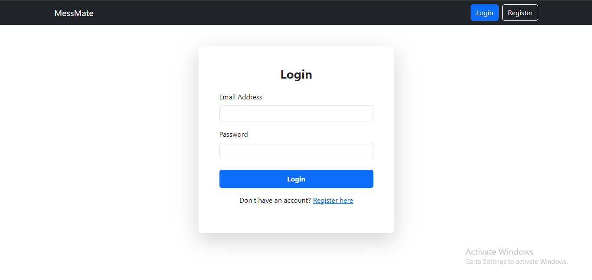
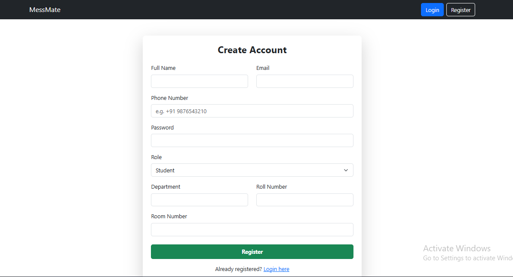
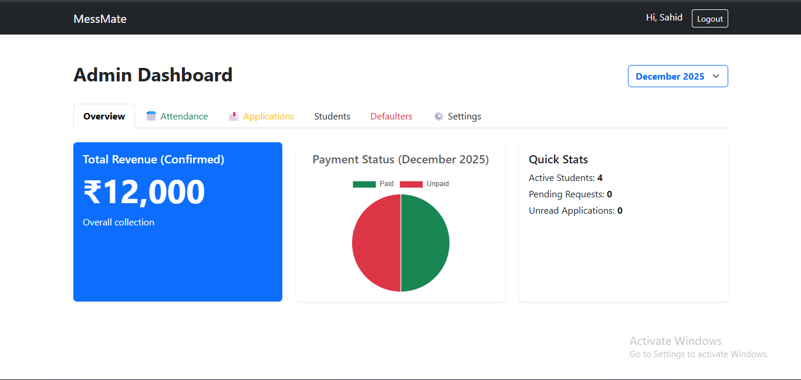
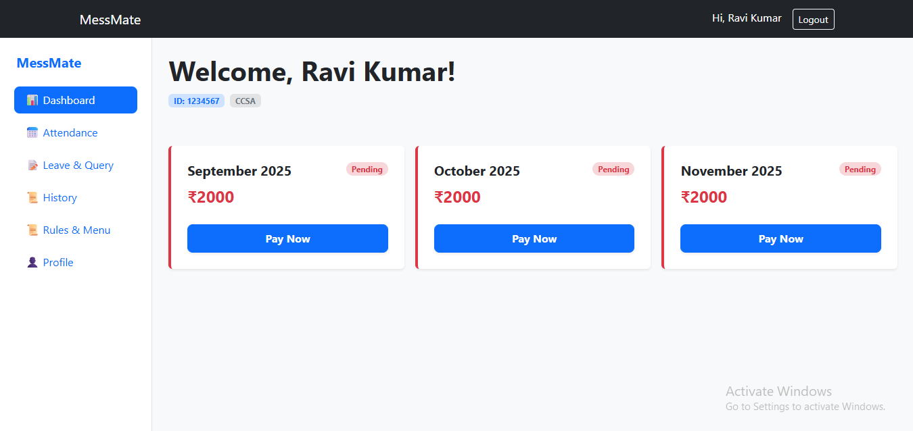

# MessMate – Hostel Mess Management System

MessMate is a full-stack hostel mess management system developed to simplify mess fee tracking, attendance management, and student record handling for hostel boarders and administrators.

## 🚀 Live Demo
https://messmate.vercel.app

---

## 📌 Features

### Admin Panel
- Manage student records
- Track mess fees
- Monitor attendance
- Database-driven management system
- Secure login authentication

### User Panel
- Student login & registration
- View attendance records
- Track mess fee status
- Responsive dashboard UI

---

## 🛠️ Tech Stack

### Frontend
- React.js
- CSS
- JavaScript
- Vite

### Backend
- Node.js
- Express.js

### Database
- MongoDB

---

## 📷 Screenshots

### Login Page


### Register Page


### Admin Dashboard


### Student Dashboard


---

## ⚙️ Installation & Setup

### Clone Repository

```bash
git clone https://github.com/Sahid1411/messmate.git
```

### Frontend Setup

```bash
cd frontend
npm install
npm run dev
```

### Backend Setup

```bash
cd backend
npm install
npm start
```

---

## 📚 Project Purpose

This project was developed as a practical hostel management solution to improve mess fee tracking and administrative workflow management.

---

## 👨‍💻 Developer

Sahid Ahmed

- GitHub: https://github.com/Sahid1411
- LinkedIn: https://www.linkedin.com/in/sahid-ahmed-0505822b9/
